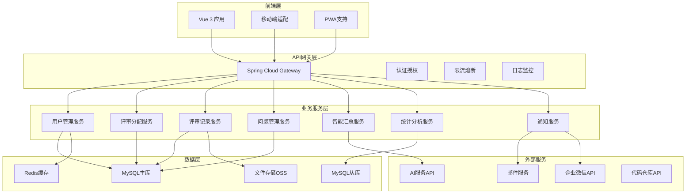
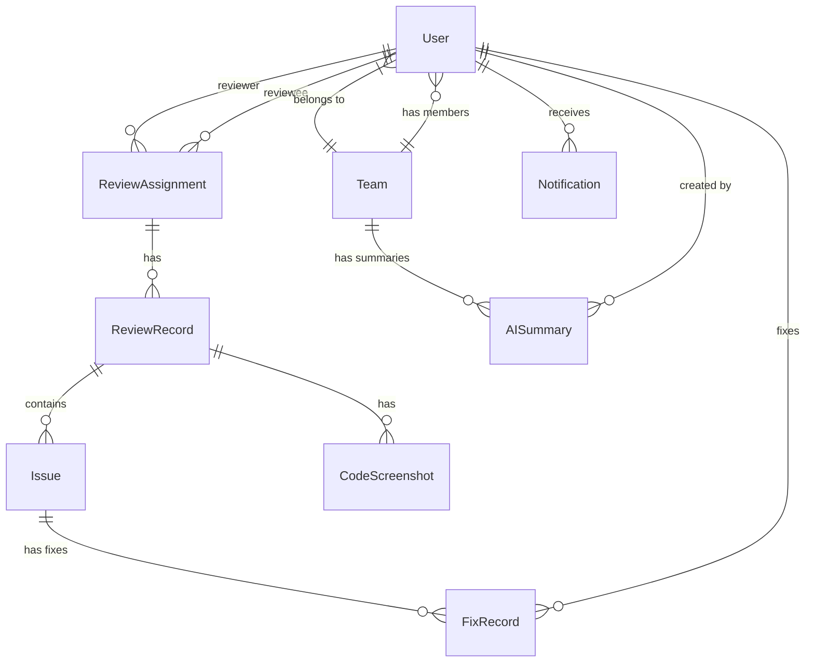

# 代码评审管理系统设计文档

## 概述

代码评审管理系统采用前后端分离的微服务架构，基于Spring Boot + Vue 3技术栈构建。系统核心包括用户管理、评审分配、记录管理、问题跟踪、智能汇总、统计分析和通知提醒七大模块。

系统设计遵循高内聚低耦合原则，通过领域驱动设计（DDD）方法划分业务边界，采用事件驱动架构处理跨模块通信，确保系统的可扩展性和可维护性。

## 架构设计

### 整体架构



### 技术架构栈

- **前端框架**: Vue 3 + TypeScript + Element Plus
- **状态管理**: Pinia
- **路由管理**: Vue Router 4
- **HTTP客户端**: Axios
- **构建工具**: Vite
- **后端框架**: Spring Boot 2.7+
- **安全框架**: Spring Security + JWT
- **数据访问**: MyBatis Plus
- **缓存**: Redis 6+
- **消息队列**: RabbitMQ
- **数据库**: MySQL 8.0
- **文件存储**: 阿里云OSS
- **API文档**: Swagger 3
- **监控**: Micrometer + Prometheus

## 组件和接口设计

### 用户管理模块

#### 核心组件
- **UserController**: 处理用户相关HTTP请求
- **UserService**: 用户业务逻辑处理
- **UserRepository**: 用户数据访问
- **AuthenticationService**: 认证服务
- **AuthorizationService**: 授权服务

#### 关键接口
```java
@RestController
@RequestMapping("/api/users")
public class UserController {
    
    @PostMapping("/login")
    public ResponseEntity<LoginResponse> login(@RequestBody LoginRequest request);
    
    @PostMapping("/logout")
    public ResponseEntity<Void> logout();
    
    @GetMapping("/profile")
    public ResponseEntity<UserProfile> getProfile();
    
    @PutMapping("/profile")
    public ResponseEntity<UserProfile> updateProfile(@RequestBody UpdateProfileRequest request);
    
    @GetMapping("/team/{teamId}/members")
    @PreAuthorize("hasRole('TEAM_LEADER') or hasRole('ARCHITECT')")
    public ResponseEntity<List<TeamMember>> getTeamMembers(@PathVariable Long teamId);
}
```

#### 权限控制设计
采用基于角色的访问控制（RBAC）模型：

```java
public enum Role {
    DEVELOPER("开发人员", Arrays.asList(
        Permission.VIEW_OWN_REVIEWS,
        Permission.CREATE_REVIEW_RECORD,
        Permission.SUBMIT_FIX_RECORD
    )),
    TEAM_LEADER("团队负责人", Arrays.asList(
        Permission.VIEW_TEAM_REVIEWS,
        Permission.MANAGE_TEAM_MEMBERS,
        Permission.GENERATE_TEAM_SUMMARY
    )),
    ARCHITECT("架构师", Arrays.asList(
        Permission.VIEW_ALL_TEAMS,
        Permission.GENERATE_WEEKLY_SUMMARY,
        Permission.MANAGE_REVIEW_STANDARDS
    ));
}
```

### 评审分配模块

#### 智能分配算法设计

```java
@Service
public class ReviewAssignmentService {
    
    /**
     * 智能分配算法核心逻辑
     * 1. 获取团队活跃成员列表
     * 2. 计算成员间的匹配度矩阵
     * 3. 应用避重约束（4周内不重复）
     * 4. 使用匈牙利算法求解最优分配
     * 5. 应用负载均衡调整
     */
    public List<ReviewAssignment> generateWeeklyAssignments(Long teamId, LocalDate weekStart) {
        List<User> activeMembers = getActiveTeamMembers(teamId);
        MatchingMatrix matrix = calculateMatchingMatrix(activeMembers, weekStart);
        List<Assignment> optimalAssignments = hungarianAlgorithm.solve(matrix);
        return applyLoadBalancing(optimalAssignments);
    }
    
    private MatchingMatrix calculateMatchingMatrix(List<User> members, LocalDate weekStart) {
        // 技能匹配度计算
        // 历史避重检查
        // 工作负载评估
    }
}
```

#### 分配规则配置
```java
@ConfigurationProperties(prefix = "review.assignment")
@Data
public class AssignmentConfig {
    private int avoidanceWeeks = 4; // 避重周期
    private int maxAssignmentsPerWeek = 3; // 每周最大任务数
    private double skillMatchWeight = 0.4; // 技能匹配权重
    private double loadBalanceWeight = 0.3; // 负载均衡权重
    private double diversityWeight = 0.3; // 多样性权重
}
```

### 评审记录模块

#### 核心实体设计
```java
@Entity
@Table(name = "review_records")
public class ReviewRecord {
    @Id
    @GeneratedValue(strategy = GenerationType.IDENTITY)
    private Long id;
    
    @ManyToOne(fetch = FetchType.LAZY)
    @JoinColumn(name = "assignment_id")
    private ReviewAssignment assignment;
    
    @Column(nullable = false)
    private String title;
    
    @Column(name = "code_repository")
    private String codeRepository;
    
    @Column(name = "code_file_path")
    private String codeFilePath;
    
    @Column(name = "overall_score")
    private Integer overallScore;
    
    @Enumerated(EnumType.STRING)
    private ReviewStatus status;
    
    @OneToMany(mappedBy = "reviewRecord", cascade = CascadeType.ALL)
    private List<CodeScreenshot> screenshots;
    
    @OneToMany(mappedBy = "reviewRecord", cascade = CascadeType.ALL)
    private List<Issue> issues;
}
```

#### 文件上传处理
```java
@Service
public class FileUploadService {
    
    @Value("${oss.bucket.name}")
    private String bucketName;
    
    public FileUploadResult uploadScreenshot(MultipartFile file, Long reviewRecordId) {
        // 文件类型验证
        validateFileType(file);
        // 文件大小检查（最大10MB）
        validateFileSize(file);
        // 生成唯一文件名
        String fileName = generateUniqueFileName(file.getOriginalFilename());
        // 上传到OSS
        String fileUrl = ossClient.uploadFile(bucketName, fileName, file.getInputStream());
        // 保存文件记录
        CodeScreenshot screenshot = new CodeScreenshot();
        screenshot.setReviewRecordId(reviewRecordId);
        screenshot.setFileUrl(fileUrl);
        screenshot.setFileName(file.getOriginalFilename());
        screenshotRepository.save(screenshot);
        
        return new FileUploadResult(fileUrl, fileName);
    }
}
```

### 问题管理模块

#### 问题实体设计
```java
@Entity
@Table(name = "issues")
public class Issue {
    @Id
    @GeneratedValue(strategy = GenerationType.IDENTITY)
    private Long id;
    
    @ManyToOne(fetch = FetchType.LAZY)
    @JoinColumn(name = "review_record_id")
    private ReviewRecord reviewRecord;
    
    @Enumerated(EnumType.STRING)
    @Column(name = "issue_type", nullable = false)
    private IssueType issueType;
    
    @Enumerated(EnumType.STRING)
    @Column(nullable = false)
    private Severity severity;
    
    @Column(nullable = false)
    private String title;
    
    @Column(columnDefinition = "TEXT")
    private String description;
    
    @Column(columnDefinition = "TEXT")
    private String suggestion;
    
    @Column(columnDefinition = "JSON")
    private List<String> referenceLinks;
    
    @Enumerated(EnumType.STRING)
    private IssueStatus status;
    
    @OneToMany(mappedBy = "issue", cascade = CascadeType.ALL)
    private List<FixRecord> fixRecords;
}
```

#### 整改跟踪流程
```java
@Service
@Transactional
public class IssueTrackingService {
    
    public void submitFixRecord(Long issueId, FixRecordRequest request) {
        Issue issue = issueRepository.findById(issueId)
            .orElseThrow(() -> new EntityNotFoundException("问题不存在"));
        
        FixRecord fixRecord = new FixRecord();
        fixRecord.setIssue(issue);
        fixRecord.setFixerId(getCurrentUserId());
        fixRecord.setFixDescription(request.getDescription());
        fixRecord.setBeforeCodeUrl(request.getBeforeCodeUrl());
        fixRecord.setAfterCodeUrl(request.getAfterCodeUrl());
        fixRecord.setStatus(FixStatus.SUBMITTED);
        
        fixRecordRepository.save(fixRecord);
        
        // 更新问题状态
        issue.setStatus(IssueStatus.IN_PROGRESS);
        issueRepository.save(issue);
        
        // 发送通知给原评审者
        notificationService.sendFixSubmittedNotification(
            issue.getReviewRecord().getAssignment().getReviewerId(),
            fixRecord
        );
    }
}
```

### 智能汇总模块

#### AI服务集成设计
```java
@Service
public class AISummaryService {
    
    @Autowired
    private OpenAIClient openAIClient;
    
    @Autowired
    private FallbackSummaryService fallbackService;
    
    @CircuitBreaker(name = "ai-service", fallbackMethod = "fallbackSummary")
    @TimeLimiter(name = "ai-service")
    public CompletableFuture<AISummaryResult> generateTeamSummary(Long teamId, LocalDate weekStart) {
        // 收集团队问题数据
        List<Issue> teamIssues = issueRepository.findTeamIssuesInWeek(teamId, weekStart);
        
        // 构建AI提示词
        String prompt = buildSummaryPrompt(teamIssues);
        
        // 调用AI服务
        OpenAIRequest request = OpenAIRequest.builder()
            .model("gpt-3.5-turbo")
            .messages(Arrays.asList(
                new Message("system", "你是一个代码质量分析专家，请分析团队代码评审问题并提供改进建议。"),
                new Message("user", prompt)
            ))
            .maxTokens(2000)
            .temperature(0.7)
            .build();
            
        OpenAIResponse response = openAIClient.createChatCompletion(request);
        
        return CompletableFuture.completedFuture(
            new AISummaryResult(response.getChoices().get(0).getMessage().getContent())
        );
    }
    
    public CompletableFuture<AISummaryResult> fallbackSummary(Long teamId, LocalDate weekStart, Exception ex) {
        // AI服务不可用时的降级处理
        return fallbackService.generateBasicSummary(teamId, weekStart);
    }
}
```

#### 问题分析算法
```java
@Component
public class IssueAnalyzer {
    
    public IssueAnalysisResult analyzeTeamIssues(List<Issue> issues) {
        // 问题类型分布统计
        Map<IssueType, Long> typeDistribution = issues.stream()
            .collect(Collectors.groupingBy(Issue::getIssueType, Collectors.counting()));
        
        // 严重级别分布统计
        Map<Severity, Long> severityDistribution = issues.stream()
            .collect(Collectors.groupingBy(Issue::getSeverity, Collectors.counting()));
        
        // 高频问题识别
        List<String> frequentIssues = identifyFrequentIssues(issues);
        
        // 趋势分析
        TrendAnalysis trend = analyzeTrend(issues);
        
        return IssueAnalysisResult.builder()
            .typeDistribution(typeDistribution)
            .severityDistribution(severityDistribution)
            .frequentIssues(frequentIssues)
            .trend(trend)
            .build();
    }
}
```

### 统计分析模块

#### 统计数据计算
```java
@Service
public class StatisticsService {
    
    public PersonalStatistics calculatePersonalStatistics(Long userId, LocalDate startDate, LocalDate endDate) {
        // 评审完成率计算
        double completionRate = calculateReviewCompletionRate(userId, startDate, endDate);
        
        // 问题发现数量统计
        long issuesFound = issueRepository.countIssuesFoundByReviewer(userId, startDate, endDate);
        
        // 整改及时率计算
        double fixTimeliness = calculateFixTimeliness(userId, startDate, endDate);
        
        // 个人成长趋势
        List<GrowthPoint> growthTrend = calculateGrowthTrend(userId, startDate, endDate);
        
        return PersonalStatistics.builder()
            .completionRate(completionRate)
            .issuesFound(issuesFound)
            .fixTimeliness(fixTimeliness)
            .growthTrend(growthTrend)
            .build();
    }
    
    @Cacheable(value = "team-statistics", key = "#teamId + '-' + #startDate + '-' + #endDate")
    public TeamStatistics calculateTeamStatistics(Long teamId, LocalDate startDate, LocalDate endDate) {
        // 使用缓存提高查询性能
        // 团队评审覆盖率
        double coverageRate = calculateTeamCoverageRate(teamId, startDate, endDate);
        
        // 问题分布统计
        Map<IssueType, Long> issueDistribution = getTeamIssueDistribution(teamId, startDate, endDate);
        
        // 代码质量趋势
        List<QualityPoint> qualityTrend = calculateQualityTrend(teamId, startDate, endDate);
        
        return TeamStatistics.builder()
            .coverageRate(coverageRate)
            .issueDistribution(issueDistribution)
            .qualityTrend(qualityTrend)
            .build();
    }
}
```

### 通知服务模块

#### 多渠道通知设计
```java
@Service
public class NotificationService {
    
    @Autowired
    private List<NotificationChannel> notificationChannels;
    
    @Async("notificationExecutor")
    public void sendNotification(NotificationRequest request) {
        // 根据用户偏好选择通知渠道
        List<NotificationChannel> enabledChannels = getEnabledChannels(request.getUserId());
        
        for (NotificationChannel channel : enabledChannels) {
            try {
                channel.send(request);
                // 记录发送成功日志
                logNotificationSuccess(request, channel.getType());
            } catch (Exception e) {
                // 记录发送失败日志
                logNotificationFailure(request, channel.getType(), e);
                // 尝试其他渠道
            }
        }
        
        // 保存通知记录到数据库
        saveNotificationRecord(request);
    }
}

@Component
public class EmailNotificationChannel implements NotificationChannel {
    
    @Override
    public void send(NotificationRequest request) {
        MimeMessage message = mailSender.createMimeMessage();
        MimeMessageHelper helper = new MimeMessageHelper(message, true, "UTF-8");
        
        helper.setTo(request.getRecipientEmail());
        helper.setSubject(request.getTitle());
        helper.setText(buildEmailContent(request), true);
        
        mailSender.send(message);
    }
}
```

## 数据模型设计

### 核心实体关系图



### 数据库索引策略

```sql
-- 评审分配表索引
CREATE INDEX idx_assignment_week_reviewer ON review_assignments(week_start_date, reviewer_id);
CREATE INDEX idx_assignment_week_reviewee ON review_assignments(week_start_date, reviewee_id);
CREATE INDEX idx_assignment_status ON review_assignments(status);

-- 评审记录表索引
CREATE INDEX idx_review_assignment ON review_records(assignment_id);
CREATE INDEX idx_review_status ON review_records(status);
CREATE INDEX idx_review_created_at ON review_records(created_at);

-- 问题表索引
CREATE INDEX idx_issue_review_record ON issues(review_record_id);
CREATE INDEX idx_issue_type_severity ON issues(issue_type, severity);
CREATE INDEX idx_issue_status ON issues(status);
CREATE INDEX idx_issue_created_at ON issues(created_at);

-- 通知表索引
CREATE INDEX idx_notification_user_unread ON notifications(user_id, is_read);
CREATE INDEX idx_notification_created_at ON notifications(created_at);
```

## 错误处理设计

### 全局异常处理
```java
@RestControllerAdvice
public class GlobalExceptionHandler {
    
    @ExceptionHandler(EntityNotFoundException.class)
    public ResponseEntity<ErrorResponse> handleEntityNotFound(EntityNotFoundException e) {
        return ResponseEntity.status(HttpStatus.NOT_FOUND)
            .body(new ErrorResponse("ENTITY_NOT_FOUND", e.getMessage()));
    }
    
    @ExceptionHandler(ValidationException.class)
    public ResponseEntity<ErrorResponse> handleValidation(ValidationException e) {
        return ResponseEntity.status(HttpStatus.BAD_REQUEST)
            .body(new ErrorResponse("VALIDATION_ERROR", e.getMessage()));
    }
    
    @ExceptionHandler(AccessDeniedException.class)
    public ResponseEntity<ErrorResponse> handleAccessDenied(AccessDeniedException e) {
        return ResponseEntity.status(HttpStatus.FORBIDDEN)
            .body(new ErrorResponse("ACCESS_DENIED", "权限不足"));
    }
    
    @ExceptionHandler(Exception.class)
    public ResponseEntity<ErrorResponse> handleGeneral(Exception e) {
        log.error("未处理的异常", e);
        return ResponseEntity.status(HttpStatus.INTERNAL_SERVER_ERROR)
            .body(new ErrorResponse("INTERNAL_ERROR", "系统内部错误"));
    }
}
```

### 业务异常定义
```java
public class BusinessException extends RuntimeException {
    private final String errorCode;
    
    public BusinessException(String errorCode, String message) {
        super(message);
        this.errorCode = errorCode;
    }
}

public class ReviewAssignmentException extends BusinessException {
    public ReviewAssignmentException(String message) {
        super("ASSIGNMENT_ERROR", message);
    }
}

public class FileUploadException extends BusinessException {
    public FileUploadException(String message) {
        super("FILE_UPLOAD_ERROR", message);
    }
}
```

## 测试策略

### 单元测试
- 使用JUnit 5 + Mockito进行单元测试
- 测试覆盖率要求达到80%以上
- 重点测试业务逻辑和算法实现

### 集成测试
- 使用TestContainers进行数据库集成测试
- 使用WireMock模拟外部服务
- 测试API接口的完整流程

### 性能测试
- 使用JMeter进行负载测试
- 模拟1000并发用户访问
- 验证响应时间和系统稳定性

### 前端测试
```javascript
// Vue组件单元测试示例
import { mount } from '@vue/test-utils'
import ReviewRecordForm from '@/components/ReviewRecordForm.vue'

describe('ReviewRecordForm', () => {
  test('should validate required fields', async () => {
    const wrapper = mount(ReviewRecordForm)
    
    await wrapper.find('form').trigger('submit')
    
    expect(wrapper.find('.error-message').text()).toContain('标题不能为空')
  })
  
  test('should upload screenshot successfully', async () => {
    const wrapper = mount(ReviewRecordForm)
    const file = new File(['screenshot'], 'test.png', { type: 'image/png' })
    
    await wrapper.find('input[type="file"]').setValue(file)
    
    expect(wrapper.vm.screenshots).toHaveLength(1)
  })
})
```

## 部署架构

### 容器化部署
```yaml
# docker-compose.yml
version: '3.8'
services:
  app:
    image: code-review-system:latest
    ports:
      - "8080:8080"
    environment:
      - SPRING_PROFILES_ACTIVE=prod
      - MYSQL_HOST=mysql
      - REDIS_HOST=redis
    depends_on:
      - mysql
      - redis
      
  mysql:
    image: mysql:8.0
    environment:
      - MYSQL_ROOT_PASSWORD=password
      - MYSQL_DATABASE=code_review
    volumes:
      - mysql_data:/var/lib/mysql
      
  redis:
    image: redis:6-alpine
    volumes:
      - redis_data:/data
      
  nginx:
    image: nginx:alpine
    ports:
      - "80:80"
      - "443:443"
    volumes:
      - ./nginx.conf:/etc/nginx/nginx.conf
      - ./ssl:/etc/nginx/ssl
```

### 监控和日志
```yaml
# 监控配置
management:
  endpoints:
    web:
      exposure:
        include: health,info,metrics,prometheus
  endpoint:
    health:
      show-details: always
  metrics:
    export:
      prometheus:
        enabled: true

# 日志配置
logging:
  level:
    com.company.codereview: INFO
    org.springframework.security: DEBUG
  pattern:
    file: "%d{yyyy-MM-dd HH:mm:ss} [%thread] %-5level %logger{36} - %msg%n"
  file:
    name: logs/application.log
    max-size: 100MB
    max-history: 30
```